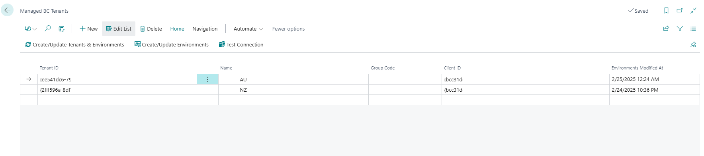
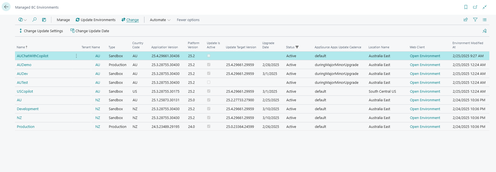
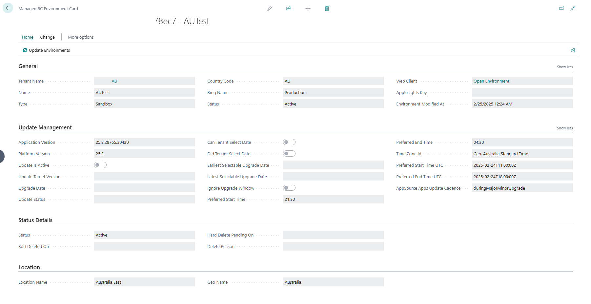

# BC Admin Open Tool

The BC Admin Open Tool is a solution designed to streamline the management of Business Central environments and tenants using the Business Central Admin Center API. This tool offers a range of functionalities that allow experienced Business Central developers and consultants to efficiently manage their environments, update settings, and scheduled updates.

With the **Managed BC Administration Apps** page, users can register and manage their Business Central Administration Apps by inputting essential details like Client ID, Name, and managing authentication certificates. The **Managed BC Tenants** page enables users to manage their tenants, including actions to create or update tenants and environments, test connections, and view environments associated with each tenant. The **Managed BC Environments** page provides detailed information about each environment, including update settings and scheduled updates, ensuring that users have all the necessary data at their fingertips.

The tool also includes advanced features such as **Tenant Group Management** for organizing tenants, **App Whitelisting** functionality for third-party applications, **Available Updates** management with modern API v2.28 support, the **Available Update Timezones** page which lists all available time zones for scheduling updates, and the **Admin Center API Setup** page where users can configure API settings and optimize the process by enabling or disabling specific endpoints.

## Why Open Source and Not Available Through AppSource

**The BC Admin Open Tool is offered as an open-source solution rather than being available through AppSource due to security and visibility concerns. As partners, we recognize the importance of maintaining full control over access tokens and ensuring that sensitive data is handled securely. By providing an open-source solution, we allow everyone to review the code before installing it in their own environments. This transparency provides high confidence that the data is secure and that your customers are safe. Open-source solutions offer the peace of mind that comes with knowing exactly how your data is being managed and that there are no hidden processes or vulnerabilities.**

## Index

- [Managed BC Administration Apps](#managed-bc-administration-apps)
  - [Client ID](#client-id)
  - [Name](#name)
  - [Certificate Management](#certificate-management)
- [Managed BC Tenants](#managed-bc-tenants)
  - [Tenant Groups](#tenant-groups)
  - [Create/Update Tenants & Environment](#createupdate-tenants--environment)
  - [Create/Update Environments](#createupdate-environments)
  - [Test Connection](#test-connection)
  - [Environments](#environments)
- [Managed BC Environments](#managed-bc-environments)
  - [App Management](#app-management)
  - [Available Updates](#available-updates)
  - [Update Settings](#update-settings)
  - [Scheduled Updates](#scheduled-updates)
  - [Update Environments](#update-environments)
  - [Change Update Date](#change-update-date)
  - [Change Update Settings](#change-update-settings)
  - [Install Apps](#install-apps)
- [AppSource Offerings](#appsource-offerings)
- [Whitelisted Third Party Apps](#whitelisted-third-party-apps)
- [Available Update Timezones](#available-update-timezones)
  - [Get Available Timezones](#get-available-timezones)
- [Admin Center API Setup](#admin-center-api-setup)
  - [API Version Support](#api-version-support)
  - [Additional Endpoints](#additional-endpoints)
  - [App Configuration](#app-configuration)
- [Permission Sets](#permission-sets)
- [User Setup](#user-setup)

# Managed BC Administration Apps

This page is designed to help you manage your Business Central Administration Apps using the Business Central Admin Center API. Here, you can input essential details like the Client ID, Name, and manage authentication certificates for your apps.

### Client ID
The **Client ID** is a field where you enter the ID of the Entra App registered to access the Business Central Admin API. This ID can belong to either a single tenant or a multi-tenant app. The Client ID is essentially your app's unique identifier, allowing it to communicate with the Business Central Admin API.

### Name
The **Name** specifies the name of your app.

### Certificate Management
The BC Admin Open Tool uses **certificate-based authentication** instead of client secrets for enhanced security. This approach provides stronger security and is the recommended method for production applications.

#### Certificate Features:
- **Create Certificate**: Generate a new self-signed certificate directly within the application
- **Download Certificate**: Export the certificate for registration in your Entra app
- **Secure Storage**: Certificates and private keys are stored securely in Isolated Storage with company scope
- **Automatic Configuration**: The tool automatically handles certificate-based OAuth 2.0 flows

#### Setup Process:
1. Create a new Administration App record with Client ID and Name
2. Use **Create Certificate** to generate a self-signed certificate
3. **Download Certificate** to get the .cer file
4. Upload the certificate to your Entra app registration
5. The tool will automatically use certificate-based authentication for all API calls

**Security Benefits**: Certificate-based authentication eliminates the need to store client secrets and provides a more secure authentication method that's harder to compromise.

# Managed BC Tenants

This page allows you to manage your Business Central tenants. You can input details such as Tenant ID, Name, Group Code, and Client ID for each tenant.

### Tenant ID
The **Tenant ID** is the ID of the tenant you want to connect to. This is a unique identifier for each tenant within Microsoft stack.

### Name
The **Name** field is a custom value where you can specify the name of the tenant. This is manually entered and can be anything that helps you identify the tenant.

### Group Code
The **Group Code** field allows you to group tenants into multiple groups. Users can be configured (in user setup) to see by default only the selected group. Note that this is not a security feature; users can remove the filter if needed.

### Client ID
The **Client ID** is the ID of the existing app (created in the Managed BC Administration Apps page). This app must have access to the specified Tenant ID to ensure proper connectivity and functionality.

## Tenant Groups

The application supports tenant group management through the **Managed BC Tenant Groups** page. Tenant groups allow you to organize your tenants for better management and filtering:

- **Code**: A unique code identifying the tenant group
- **Description**: A descriptive name for the group
- **Status**: Groups can be Active or Inactive. Only tenants in active groups will be processed during API operations

Tenant groups provide an organizational layer that helps in:
- Filtering environments by tenant groups in the user interface
- Controlling which tenants are processed during bulk operations
- Organizing tenants based on customer, project, or any other business logic

## Actions

### Create/Update Tenants & Environment
This is the most powerful action on the **Managed BC Tenants** page. It downloads all tenants for all registered apps and all environments for all registered tenants. If a tenant or environment does not exist, it is created; otherwise, it is updated. 

**Important Limitation**: Every app must have at least one environment registered manually for this action to be able to download all other environments.

### Create/Update Environments
This action allows you to create or update all environments for selected tenants. You can select multiple tenants, and the action will ensure that all environments for those tenants are either created or updated as needed.

### Environments
This action opens a list of environments that belong to the selected tenant. It allows you to view and manage all environments associated with the specified Tenant ID.

### Test Connection
This action verifies that the combination of Tenant ID and Client ID works correctly. It ensures that the specified Tenant ID can be accessed using the provided Client ID.

# Managed BC Environments

This page allows you to manage the environments associated with your Business Central tenants. It includes fields for the environment name, tenant name, and various other details obtained from multiple API endpoints.

### Name
The **Name** field displays the name of the environment as retrieved from the API.

### Tenant Name
The **Tenant Name** field shows the name of the associated tenant, as specified in the Managed BC Tenants page.

## App Management

The Managed BC Environments page provides comprehensive app management functionality:

### App Counts
The page displays several app-related metrics for each environment:
- **No. of Apps**: Total number of AppSource apps installed in the environment
- **No. of Our Apps**: Number of apps published by your organization (configurable in Admin Center API Setup)
- **No. of Third-Party Apps**: Number of apps from other publishers (excluding Microsoft)
- **No. of Third-Party Apps excl. Whitelisted**: Third-party apps that are not on your whitelist (highlighted if > 0)

### App Actions
- **Apps**: Opens the Managed BC Environment Apps page to view and manage individual apps
- **Add to Whitelisted Apps**: Allows adding third-party apps to a whitelist for better organization

## Available Updates

The tool supports modern update management through the Admin Center API v2.28:

### Available Updates Page
Each environment has an **Available Updates** action that opens a dedicated page showing:
- **Target Version**: The version number available for update
- **Target Version Type**: Type of update (GA, Preview, etc.)
- **Available**: Whether the update has been released
- **Selected**: Whether this version is selected for the next update
- **Expected Availability**: When the update is expected to be available
- **Latest Selectable Date**: Last date the update can be scheduled
- **Rollout Status**: Current rollout status of the update

### Update Fields
New update-related fields are available on the environment card:
- **Update Available Target Version**: Latest available version for update
- **Update Selected Target Version**: Currently selected version for update  
- **Update Is Scheduled**: Whether an update is currently scheduled

### Additional Fields
The additional fields on the **Managed BC Environments** page provide comprehensive information about each environment. These fields are obtained from multiple API endpoints and include details about the environment, update settings, and scheduled updates. Here are some of the key fields:

#### Environment Information
- **Type**: The type of environment (e.g., Sandbox, Production).
- **Name**: The unique name of the environment within an application family.
- **Country Code**: The country or region where the environment is deployed.
- **Tenant ID**: The ID of the Microsoft Entra tenant that owns the environment.
- **Application Version**: The version of the environment's application.
- **Status**: The current status of the environment (e.g., NotReady, Removing, Preparing, Active).
- **Location Name**: The Azure location where the environment's data is stored.
- **Platform Version**: The version of the environment's Business Central platform.
- **Ring Name**: The name of the environment's logical ring group (e.g., Prod, Preview).
- **App Insights Key**: The environment's key for Azure Application Insights.
- **Soft Deleted On**: The time at which the environment was soft deleted.
- **Hard Delete Pending On**: The time at which the environment will be permanently deleted.
- **Delete Reason**: The reason why the environment was deleted.
- **AppSource Apps Update Cadence**: The cadence at which installed AppSource Apps are automatically updated with environment updates.

#### Update Settings
- **Preferred Start Time**: Start of environment update window in 24h format (HH:mm).
- **Preferred End Time**: End of environment update window in 24h format (HH:mm).
- **Time Zone ID**: Windows time zone identifier.
- **Preferred Start Time UTC**: Start of an environment's update window, expressed as a UTC timestamp.
- **Preferred End Time UTC**: End of an environment's update window, expressed as a UTC timestamp.

#### Scheduled Updates
- **Update Target Version**: The version of the application that the environment will update to.
- **Can Tenant Select Date**: Indicates if a new update date can be selected.
- **Did Tenant Select Date**: Indicates if the tenant has selected the current date for the update.
- **Earliest Selectable Upgrade Date**: Specifies the earliest date that can be chosen for the update.
- **Latest Selectable Upgrade Date**: Specifies the latest date that can be chosen for the update.
- **Upgrade Date**: The currently selected scheduled date of the update.
- **Update Status**: The current status of the environment's update (e.g., "Scheduled" or "Running").
- **Ignore Upgrade Window**: Indicates if the environment's update window will be ignored.
- **Update Is Active**: Indicates if the update is activated and is scheduled to occur.

**Note**: Some of the fields on this page are hidden by default, and some fields are available only on the Managed BC Environment Card.

**Note**: The list is filtered by default to hide soft deleted environments.

**Note**: Based on the user setup, the list may be filtered to show only environments from one group.

## Actions

### Update Environments
This action updates the selected environments. It retrieves the latest values from the API and updates the corresponding Business Central records to ensure they reflect the most current information and settings.

### Change Update Date
This action allows you to change the scheduled update date for selected environments. The functionality varies significantly based on the API version:

#### API v2.28 and newer:
**Target Version Selection**: Choose from available updates using a lookup that shows:
- Available versions with their types (GA, Preview, etc.)
- Expected availability dates
- Rollout status information
- Version-specific selectable date ranges

**Enhanced Date Selection**: 
- Specify a new update date within the allowed timeframe for the selected version
- Each target version has its own earliest and latest selectable dates
- Date validation based on the selected target version

**Update Window Control**: Option to ignore the environment's configured update window for the specific update.

**Version Restrictions**: Only General Availability (GA) versions can be selected through this interface for security and stability.

#### API v2.24 (Legacy Implementation - Deprecated):
**Simple Date Change**: Direct modification of the scheduled update date without target version selection.
- Uses the existing target version from the scheduled update
- Basic date validation against environment-wide date ranges
- Limited metadata and update information

**Migration Note**: Legacy functionality is automatically hidden when using API v2.28 and will be completely removed in Business Central v29.0.

**Requirements**: 
- The update date must be in the future and within the allowed period for the selected environment and target version
- Target version must be available and support scheduling
- Environment must have active tenant group status

### Change Update Settings
This action allows you to change the preferred start time, end time, and time zone for the selected environments. All values must be specified. The time zone must be selected from the available time zones (which will be described later).

### Install Apps
This action allows you to install AppSource apps to selected environments. You can choose multiple environments, and the action will display a request page with installation options.

#### Request Page Options
- **Use Environment Update Window**: Specifies whether to respect the environment's update window when installing apps. When enabled, apps will only be installed during the configured update window.
- **Install/Update Needed Dependencies**: Determines whether to automatically install or update any required dependencies for the selected apps.

The page also includes a subform where you can select which apps to install from the available AppSource offerings.

After the installation process completes, you'll receive a summary showing:
- Number of successfully installed apps
- Number of apps skipped (already installed in the environment)
- Number of apps not found (either not available in AppSource or not compatible with environment's localization) including details (tenant, environment, app, version and localization)
- Number of apps that couldn't be installed due to missing dependencies including details (tenant, environment and information about missing dependencies). You can install dependencies automatically by enabling option **Install/Update Needed Dependencies** on the request page.

# Whitelisted Third Party Apps

This page manages a list of approved third-party applications that you want to track separately from other third-party apps. This feature helps in:

### App Organization
- **Publisher**: The publisher name of the whitelisted app
- **Name**: The name of the whitelisted app
- **AppId**: The unique identifier of the app
- **Comment**: Optional comment about why the app is whitelisted

### Automatic Detection
When third-party apps are discovered in environments, they are automatically checked against the whitelist and marked appropriately. This helps in:
- Identifying unexpected third-party apps in environments
- Maintaining visibility of approved vs. unapproved applications
- Supporting compliance and governance requirements

### Management Actions
- Apps can be added to the whitelist directly from the Environment Apps page
- Whitelisted status is automatically applied to existing environment apps when added
- Individual environment apps can be marked as whitelisted per environment if needed

# AppSource Offerings

This page displays a list of AppSource offerings, providing information about available apps in the AppSource marketplace. This page is managed manually and defines apps available for other processes (such as list of apps available to install to environments.)

### AppId
The **AppId** field displays the unique identifier of the AppSource app. The app must be available in the AppSource.

### Name
The **Name** field shows the name of the AppSource app as it appears in the marketplace.

# Available Update Timezones

This page contains a list of available time zones. The records on this page should not be changed manually.

## Actions

### Get Available Timezones
This action updates the page by deleting all existing records and recreating them from the API. It ensures that the list of time zones is always up to date with the latest information.

# Admin Center API Setup

This setup page allows you to configure the Admin Center API settings. 

**Note**: Do not change the URL and scopes unless you are familiar with the consequences.

## API Version Support

The application supports multiple API versions with significant differences in update management capabilities:

### API v2.24 (Legacy - Being Phased Out)
- **Limited Update Management**: Uses simple scheduled update approach
- **Single Update Endpoint**: `/environments/{environmentName}/upgrade` 
- **Simple Update Fields**: Basic fields like `UpdateTargetVersion`, `UpgradeDate`, `UpdateIsActive`
- **Legacy Change Update Date**: Direct date modification without version selection
- **Deprecation Notice**: This version will be **removed in Business Central 2026 wave 2 (v29.0)**

### API v2.28 (Modern - Current Implementation)
- **Enhanced Update Management**: Flexible update system with multiple target versions
- **Multiple Update Endpoints**: 
  - `/environments/{environmentName}/updates` - Get available updates
  - `/environments/{environmentName}/updates/{targetVersion}` - Schedule specific version update
- **Rich Update Information**: Detailed available updates with metadata:
  - Target versions with types (GA, Preview, etc.)
  - Rollout status and expected availability
  - Selectable date ranges per version
  - Selected vs. available updates distinction
- **Advanced Change Update Date**: Version-specific scheduling with target version lookup
- **Available Updates Page**: Dedicated interface for viewing and managing available updates

### Migration Strategy
The application follows a gradual migration approach across Business Central versions:

#### **New Installations (All Versions)**:
- Automatically configured with API v2.28
- All modern features available immediately
- No legacy functionality visible

#### **Existing Installations**:

**Current Behavior**: 
- Retain current API version (typically v2.24)
- No automatic migration during updates
- **Manual Migration Available**: Switch to v2.28 in Admin Center API Setup if desired

**Business Central v28.0 (CLEAN28)**:
- v2.28 becomes the **default for upgraded installations**
- Legacy v2.24 remains available as optional fallback
- Users can still manually switch between v2.24 and v2.28
- Recommended to migrate to v2.28 for enhanced features

**Business Central v29.0 (CLEAN29)**:
- **Only v2.28 supported** - complete removal of v2.24
- Forced migration for any remaining v2.24 installations
- All legacy functionality permanently removed

### How to Switch API Versions

#### To Enable Modern Features (v2.28):
1. Navigate to **Admin Center API Setup** page
2. Change **API Version** field from "v2.24" to "v2.28"  
3. Modern features become immediately available:
   - Available Updates page for each environment
   - Enhanced Change Update Date with target version selection
   - New update fields and improved scheduling

#### To Revert to Legacy (v2.24) - Until v29.0:
1. Navigate to **Admin Center API Setup** page
2. Change **API Version** field from "v2.28" to "v2.24"
3. Legacy interface becomes visible again

**Important**: After v29.0, reverting to v2.24 will no longer be possible.

## App Configuration

### Our Publisher Name
Configure your organization's publisher name to distinguish your apps from third-party apps in the environment listings.

### Exclude Hidden Apps
Enable this option to exclude apps with names starting with "_Exclude" from being displayed in app lists. This helps clean up the interface by hiding system or internal apps.

## Additional Endpoints
You can enable or disable additional endpoints that are run automatically when the list of environments is updated. This can be used to optimize the process if you don't need some of the endpoints. For example, if you do not plan to change update settings, there is no reason to download information from this endpoint.

### Configurable Endpoints
- **Get Scheduled Update**: Downloads scheduled update information (legacy API v2.24 only)
- **Get Updates**: Downloads available updates information (API v2.28 and later) 
- **Get Update Settings**: Downloads environment update window settings
- **Get Installed Apps**: Downloads list of installed apps for each environment

# Permission Sets

The BC Admin Open Tool provides a comprehensive permission model with multiple permission sets to support different user roles:

## BC Admin Read
Base permission set that provides read-only access to all BC Admin tool data. This includes:
- View managed BC environments and apps
- View tenants and tenant groups
- View AppSource offerings and whitelisted apps
- View update information and API setup

## BC Admin Manage Environments  
Extends read permissions with the ability to:
- Modify environment data
- Update environment apps information
- Manage environment-specific settings

## BC Admin Edit Apps
Provides permissions for app-related operations:
- Install apps to environments
- Manage AppSource offerings
- Handle whitelisted third-party apps

## BC Admin Manage Tenants
Includes environment management plus:
- Create, modify, and delete tenant records
- Manage tenant groups
- Handle tenant-to-app relationships

## BC Admin Admin
Full administrative access combining all other permission sets plus:
- Configure API setup
- Manage available update timezones
- Full access to tenant group management
- Administrative functions across the tool

# User Setup

The tool extends the standard User Setup page with BC Admin specific functionality:

## Visible BC Tenant Group Code
Users can configure a default tenant group filter that automatically applies when viewing the Managed BC Environments page. This helps users focus on environments from specific tenant groups without having to manually apply filters each time.

**Usage**: 
- Set the field to a valid tenant group code
- The Managed BC Environments page will automatically filter to show only environments from that tenant group
- Users can still remove or modify the filter manually if needed
- This setting is per-user and does not affect other users' views

**Note**: This is a convenience feature, not a security restriction. Users with appropriate permissions can still access environments from other groups by modifying the filters.
